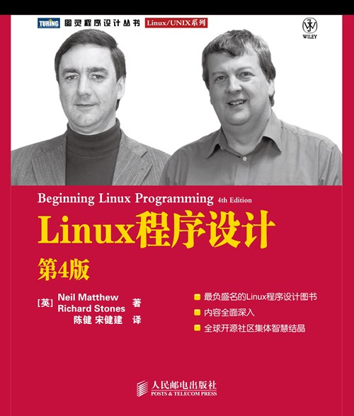

# Linux程序设计(第4版)-腾讯AI编程助手增加注释 [边学边练](https://cloudstudio.net/) 请点赞

[图灵社区关于本书的介绍](https://www.ituring.com.cn/book/171) [人民邮电出版社京东自营官方旗舰店 本书购买链接](https://item.jd.com/13078641.html)

[](https://cloudstudio.net/a/22215558653411328?channel=share&sharetype=Markdown)

作者:**[英]Neil Matthew,[英]Richard Stones**

译者:**陈健 宋健建**

```bash
Makefile 帮助信息 v1360_id_1328 :
提交id_v1370

可用的构建目标:
  0_更新到最新版本
    : 首先执行这里
  23_build_all
    : 构建项目(默认)
  11_install_lib_for_club
    : 本目标只是在club教程中运行
            快速安装构建需要用到的几个库
  12_init_for_cloudstudio
    : 本目标只是在cloudstudio工作空间中运行
      只需要运行1次就可以了
  5_show
    : 通过git clean -xdf -n
        查看构建了哪些_可执行文件
  7_clean_all
    : 清理生成的文件
  8_安装本仓库需要用的vscode扩展
    : 安装本仓库需要用的vscode扩展
  help
    : 显示此帮助信息

```



#### 我自学 我自讲

恋爱与撒狗粮专业研究生,是一个在云上工作室cloudstudio.net中,

在腾讯云AI编程助手与智谱codegeex的辅助下,

为智谱ChatGLM3大模型微调,如何一步一步的,准备数据的,系列分享.

"我自学,我自讲" 侧重在:

    智谱ChatGLM3大模型,腾讯云HAI高性能计算平台上,如何与ollama相互配合与互动的模式下,实现该大模型的本地化部署,应用开发与微调.

    并将使用智谱AI的bigmodel.cn的各种大模型全家桶,创作"基于python语言开发的智能体".

这里是本系列分享的第cb01个文章与cloudstudio应用:

"贝加尔阿楠和小嗒莎在西伯利亚结婚了". 故事主线将沿着,男主与女主,在北京相遇,流浪在北京时候的故事展开.

我就是传说中的 赶考赶考

欢迎加上面VX提供故事线索.


#### 简介

本书讲述了Linux 系统及其他UNIX 风格的操作系统上的程序开发,主要内容包括标准Linux C 语言函数库和由不同的Linux 或UNIX 标准指定的各种工具的使用方法,大多数标准Linux 开发工具的使用方法,通过DBM 和MySQL 数据库系统存储Linux 中的数据,为X 视窗系统建立图形化用户界面等.本书通过先介绍程序设计理论,再以适当的例子和清晰的解释来阐明它的方式,帮助读者迅速掌握相关的知识.
　　本书适合Linux 的初学者及希望利用Linux 进行开发的程序人员阅读,也适合作为高等院校计算机相关专业师生的参考教材.

    时至今日,linux系统已经从一个个人作品发展为可以用于各种关键任务的成熟,高效和稳定的操作系统,因为具备跨平台,开源,支持众多应用软件和网络协议等优点,它得到了各大主流软硬件厂商的支持,也成为广大程序设计人员理想的开发平台.

本书是linux程序设计领域的经典名著,以简单易懂,内容全面和示例丰富而受到广泛好评.中文版前两版出版后,在国内的linux爱好者和程序员中也引起了强烈反响,这一热潮一直持续至今.

本书是国内读者翘首以待的第4版,此次新版内容组织更加严谨,译者更是细心雕琢,保留了这部权威著作的原汁原味.

对linux所提供的功能全面而准确的阐述,以及贯穿全书的示例程序体验,使本书不仅成为初学者的最佳linux程序设计指南,而且是中高级程序员不可或缺的参考书

#### 本书特色

最负盛名的Linux程序设计图书
内容全面深入
全球开源社区集体智慧结晶

"本书介绍了大量实际应用领域的基本概念和做法,它是程序员笔记的精华摘要,经过破译和编辑,并有机地组织在了一起."
——Alan Cox,Linux内核维护者

时至今日,Linux系统已经从一个个人作品发展为可以用于各种关键任务的成熟,高效和稳定的操作系统,因为具备跨平台,开源,支持众多应用软件和网络协议等优点,它得到了各大主流软硬件厂商的支持,也成为广大程序设计人员理想的开发平台.

本书是Linux程序设计领域的经典名著,以简单易懂,内容全面和示例丰富而受到广泛好评.中文版前两版出版后,在国内的Linux爱好者和程序员中也引起了强烈反响,这一热潮一直持续至今.本书是国内读者翘首以待的第4版,此次新版内容组织更加严谨,译者更是细心雕琢,保留了这部权威著作的原汁原味.

对Linux所提供的功能全面而准确的阐述,以及贯穿全书的示例程序体验,使本书不仅成为初学者的最佳Linux程序设计指南,而且是中高级程序员不可或缺的参考书.

#### 作译者介绍

作者:
Neil Matthew 和Richard Stones世界知名的Linux/UNIX专家,有数十年Linux/UNIX开发经验和从业经历.

他们使用过几乎所有UNIX版本,并精通C/C++,LISP,Fortran,Perl,Tcl和Prolog等各种语言.

他们从事过各种软件项目,从实时嵌入式系统到会计系统和零售信息系统.除本书外,他们还合著了PostgreSQL,MySQL方面的图书.

译者:

陈健 　毕业于南京大学,1996年获电子学学士,2002年获计算机硕士,现工作于南京大学网络信息中心.长期从事于软件研发和教学工作,主要研究方向为网络管理.

宋健建　毕业于南京大学计算机系,分别于1997年和2003年获学士,硕士学位,从事软件开发多年,现任教于南京大学软件学院,主要研究方向为Linux和嵌入式系统软件.

#### 目录

##### **第1章 入门 1**

**1.1 unix,linux和gnu简介 1**

**1.1.1 什么是unix 1**

**1.1.2 什么是linux 2**

**1.1.3 gnu项目和**[自由软件基金会](https://baike.baidu.com/item/%E8%87%AA%E7%94%B1%E8%BD%AF%E4%BB%B6%E5%9F%BA%E9%87%91%E4%BC%9A/6653246?fromModule=lemma_inlink) **3**

**1.1.4 linux发行版 3**

**1.2 linux程序设计 4**

**1.2.1 linux程序 4**

**1.2.2 文本编辑器 5**

**1.2.3 c语言编译器 5**

**1.2.4 开发系统导引 7**

**1.3 获得帮助 12**

**1.4 小结 14**

##### **第2章 shell程序设计 15**

**2.1 为什么使用shell编程 15**

**2.2 一点哲学 16**

**2.3 什么是shell 16**

**2.4 管道和重定向 18**

**2.4.1 重定向输出 18**

**2.4.2 重定向输入 19**

**.2.4.3 管道 19**

**2.5 作为程序设计语言的shell 20**

**2.5.1 交互式程序 20**

**2.5.2 创建脚本 21**

**2.5.3 把脚本设置为可执行 22**

**2.6 shell的语法 23**

**2.6.1 变量 23**

**2.6.2 条件 27**

**2.6.3 控制结构 29**

**2.6.4 函数 39**

**2.6.5 命令 42**

**2.6.6 命令的执行 58**

**2.6.7** [here文档](https://baike.baidu.com/item/here%E6%96%87%E6%A1%A3/16003193?fromModule=lemma_inlink) **61**

**2.6.8 调试脚本程序 63**

**2.7 迈向图形化:dialog工具 63**

**2.8 综合应用 68**

**2.8.1 需求 68**

**2.8.2 设计 68**

**2.8.3 应用程序的说明 76**

**2.9 小结 77**

##### **第3章 文件操作 78**

**3.1 linux文件结构 78**

**3.1.1 目录 79**

**3.1.2 文件和设备 79**

**3.2 系统调用和**[设备驱动程序](https://baike.baidu.com/item/%E8%AE%BE%E5%A4%87%E9%A9%B1%E5%8A%A8%E7%A8%8B%E5%BA%8F/310766?fromModule=lemma_inlink) **80**

**3.3 库函数 81**

**3.4 底层文件访问 82**

**3.4.1 write系统调用 82**

**3.4.2 read系统调用 83**

**3.4.3 open系统调用 84**

**3.4.4 访问权限的初始值 85**

**3.4.5 其他与文件管理有关的系统调用 88**

**3.5 标准i/o库 91**

**3.5.1 fopen函数 91**

**3.5.2 fread函数 92**

**3.5.3 fwrite函数 92**

**3.5.4 fclose函数 92**

**3.5.5 fflush函数 93**

**3.5.6 fseek函数 93**

**3.5.7 fgetc,getc和getchar函数 93**

**3.5.8 fputc,putc和putchar函数 94**

**3.5.9 fgets和gets函数 94**

**3.6 格式化输入和输出 94**

**3.6.1 printf,fprintf和sprintf函数 94**

**3.6.2 scanf,fscanf和sscanf函数 96**

**3.6.3 其他流函数 98**

**3.6.4 文件流错误 99**

**3.6.5 文件流和文件描述符 99**

**3.7 文件和目录的维护 100**

**3.7.1 chmod系统调用 100**

**3.7.2 chown系统调用 100**

**3.7.3 unlink,link和symlink系统调用 100**

**3.7.4 mkdir和rmdir系统调用 101**

**3.7.5 chdir系统调用和getcwd函数 101**

**3.8 扫描目录 102**

**3.8.1 opendir函数 102**

**3.8.2 readdir函数 102**

**3.8.3 telldir函数 103**

**3.8.4 seekdir函数 103**

**3.8.5 closedir函数 103**

**3.9 错误处理 106**

**3.9.1 strerror函数 106**

**3.9.2 perror函数 106**

**3.10 /proc文件系统 107**

**3.11 高级主题:fcntl和mmap 110**

**3.11.1 fcntl系统调用 110**

**3.11.2 mmap函数 111**

**3.12 小结 113**

##### **第4章 linux环境 114**

**4.1 程序参数 114**

**4.1.1 getopt 116**

**4.1.2 getopt_long 118**

**4.2 环境变量 120**

**4.2.1 环境变量的用途 122**

**4.2.2 environ变量 122**

**4.3 时间和日期 123**

**4.4 临时文件 129**

**4.5 用户信息 131**

**4.6 主机信息 134**

**4.7 日志 135**

**4.8 资源和限制 139**

**4.9 小结 143**

##### **第5章 终端 144**

**5.1 对终端进行读写 144**

**5.2 与终端进行对话 149**

**5.3 终端驱动程序和通用终端接口 151**

**5.3.1 概述 151**

**5.3.2 硬件模型 151**

**5.4 termios结构 152**

**5.4.1 输入模式 153**

**5.4.2 输出模式 154**

**5.4.3 控制模式 155**

**5.4.4 本地模式 155**

**5.4.5 特殊控制字符 155**

**5.4.6 终端速度 158**

**5.4.7 其他函数 159**

**5.5 终端的输出 162**

**5.5.1 终端的类型 163**

**5.5.2 识别终端类型 163**

**5.5.3 使用terminfo功能标志 165**

**5.6 检测击键动作 170**

**5.7 虚拟控制台 172**

**5.8 伪终端 173**

**5.9 小结 174**

##### **第6章 使用curses函数库管理基于文本的屏幕 175**

**6.1 用curses函数库进行编译 175**

**6.2 curses术语和概念 176**

**6.3 屏幕 178**

**6.3.1 输出到屏幕 179**

**6.3.2 从屏幕读取 180**

**6.3.3 清除屏幕 180**

**6.3.4 移动光标 180**

**6.3.5 字符属性 181**

**6.4 键盘 183**

**6.4.1 键盘模式 183**

**6.4.2 键盘输入 184**

**6.5 窗口 185**

**6.5.1 window结构 185**

**6.5.2 通用函数 186**

**6.5.3 移动和更新窗口 187**

**6.5.4 优化屏幕刷新 190**

**6.6 子窗口 191**

**6.7 keypad模式 193**

**6.8 彩色显示 195**

**6.9 pad 198**

**6.10 cd唱片应用程序 200**

**6.10.1 新cd唱片应用程序的开始部分 200**

**6.10.2** [main函数](https://baike.baidu.com/item/main%E5%87%BD%E6%95%B0/6887703?fromModule=lemma_inlink) **202**

**6.10.3 建立菜单 203**

**6.10.4 操作数据库文件 204**

**6.10.5 查询cd数据库 209**

**6.11 小结 213**

##### **第7章 数据管理 214**

**7.1 内存管理 214**

**7.1.1 简单的内存分配 214**

**7.1.2 分配大量的内存 215**

**7.1.3 滥用内存 218**

**7.1.4 空指针 219**

**7.1.5 释放内存 220**

**7.1.6 其他内存分配函数 221**

**7.2 文件锁定 222**

**7.2.1 创建锁文件 222**

**7.2.2 区域锁定 225**

**7.2.3 锁定状态下的读写操作 227**

**7.2.4 文件锁的竞争 232**

**7.2.5 其他锁命令 236**

**7.2.6 死锁 236**

**7.3 数据库 237**

**7.3.1 dbm数据库 237**

**7.3.2 dbm例程 238**

**7.3.3 dbm访问函数 239**

**7.3.4 其他dbm函数 242**

**7.4 cd唱片应用程序 244**

**7.4.1 更新设计 244**

**7.4.2 使用dbm数据库的cd唱片应用程序 245**

**7.5 小结 262**

##### **第8章 mysql 263**

**8.1 安装 263**

**8.1.1 mysql软件包 264**

**8.1.2 安装后的配置 266**

**8.1.3 安装后的故障修复 270**

**8.2 mysql管理 270**

**8.2.1 命令 270**

**8.2.2 创建用户并赋予权限 274**

**8.2.3 密码 276**

**8.2.4 创建数据库 276**

**8.2.5 数据类型 277**

**8.2.6 创建表 278**

**8.2.7 图形化工具 280**

**8.3 使用c语言访问mysql数据 283**

**8.3.1 连接例程 283**

**8.3.2 错误处理 287**

**8.3.3 执行sql语句 288**

**8.3.4 更多的函数 301**

**8.4 cd数据库应用程序 301**

**8.4.1 创建表 302**

**8.4.2 添加数据 304**

**8.4.3 使用c语言访问数据 306**

**8.5 小结 316**

##### **第9章 开发工具 317**

**9.1 多个源文件带来的问题 317**

**9.2 make命令和makefile文件 318**

**9.2.1 makefile的语法 318**

**9.2.2 make命令的选项和参数 318**

**9.2.3 makefile文件中的注释 321**

**9.2.4 makefile文件中的宏 321**

**9.2.5 多个目标 323**

**9.2.6 内置规则 325**

**9.2.7 后缀和模式规则 326**

**9.2.8 用make管理函数库 327**

**9.2.9 高级主题:makefile文件和子目录 329**

**9.2.10 gnu make和gcc 329**

**9.3 源代码控制 330**

**9.3.1 rcs 331**

**9.3.2 sccs 336**

**9.3.3 rcs和sccs的比较 336**

**9.3.4 cvs 337**

**9.3.5 cvs的前端程序 340**

**9.3.6 subversion 341**

**9.4 编写手册页 342**

**9.5 发行软件 345**

**9.5.1 patch程序 345**

**9.5.2 其他软件发行工具 347**

**9.6 rpm软件包 349**

**9.6.1 使用rpm软件包文件 349**

**9.6.2 安装rpm软件包 350**

**9.6.3 创建rpm软件包 350**

**9.7 其他软件包格式 358**

**9.8 开发环境 358**

**9.8.1 kdevelop 358**

**9.8.2 其他开发环境 360**

**9.9 小结 360**

##### **第10章 调试 361**

**10.1 错误类型 361**

**10.2 常用调试技巧 362**

**10.2.1 有漏洞的程序 362**

**10.2.2 代码检查 364**

**10.2.3 取样法 365**

**10.2.4 程序的受控执行 367**

**10.3 使用gdb进行调试 368**

**10.3.1 启动gdb 368**

**10.3.2 运行一个程序 369**

**10.3.3 栈跟踪 369**

**10.3.4 检查变量 370**

**10.3.5 列出程序源代码 370**

**10.3.6 设置断点 371**

**10.3.7 用调试器打补丁 374**

**10.3.8 深入学习gdb 375**

**10.4 其他调试工具 375**

**10.4.1 lint:清理程序中的"垃圾" 376**

**10.4.2 函数调用工具 378**

**10.4.3 用prof/gprof产生执行存档 380**

**10.5 断言 381**

**10.6 内存调试 383**

**10.6.1 electricfence函数库 383**

**10.6.2 valgrind 384**

**10.7 小结 387**

##### **第11章 进程和信号 388**

**11.1 什么是进程 388**

**11.2 进程的结构 388**

**11.2.1 进程表 390**

**11.2.2 查看进程 390**

**11.2.3 系统进程 391**

**11.2.4 进程调度 393**

**11.3 启动新进程 394**

**11.3.1 等待一个进程 399**

**11.3.2 僵尸进程 401**

**11.3.3 输入和输出重定向 403**

**11.3.4 线程 404**

**11.4 信号 404**

**11.4.1 发送信号 408**

**11.4.2 信号集 412**

**11.5 小结 415**

##### **第12章 posix线程 416**

**12.1 什么是线程 416**

**12.2 线程的优点和缺点 417**

**12.3 第一个线程程序 418**

**12.4 同时执行 421**

**12.5 同步 423**

**12.5.1 用信号量进行同步 423**

**12.5.2 用互斥量进行同步 427**

**12.6 线程的属性 431**

**12.7 取消一个线程 435**

**12.8 多线程 438**

**12.9 小结 442**

##### **第13章** [进程间通信](https://baike.baidu.com/item/%E8%BF%9B%E7%A8%8B%E9%97%B4%E9%80%9A%E4%BF%A1/1235923?fromModule=lemma_inlink):管道 443

**13.1 什么是管道 443**

**13.2 进程管道 444**

**13.3 将输出送往popen 445**

**13.3.1 传递更多的数据 446**

**13.3.2 如何实现popen 447**

**13.4 pipe调用 449**

**13.5 父进程和子进程 451**

**13.5.1 管道关闭后的读操作 453**

**13.5.2 把管道用作标准输入和标准输出 454**

**13.6 命名管道:fifo 456**

**13.6.1 访问fifo文件 458**

**13.6.2 高级主题:使用fifo的客户/服务器应用程序 464**

**13.7 cd数据库应用程序 468**

**13.7.1 目标 469**

**13.7.2 实现 469**

**13.7.3 客户接口函数 472**

**13.7.4 服务器接口server.c 478**

**13.7.5 管道 481**

**13.7.6 对cd数据库应用程序的总结 487**

**13.8 小结 487**

##### **第14章 信号量,共享内存和消息队列 488**

**14.1 信号量 488**

**14.1.1 信号量的定义 489**

**14.1.2 一个理论性的例子 489**

**14.1.3 linux的**[信号量机制](https://baike.baidu.com/item/%E4%BF%A1%E5%8F%B7%E9%87%8F%E6%9C%BA%E5%88%B6/9175303?fromModule=lemma_inlink) **490**

**14.1.4 使用信号量 492**

**14.2 共享内存 496**

**14.2.1 shmget函数 497**

**14.2.2 shmat函数 497**

**14.2.3 shmdt 498**

**14.2.4 shmctl 498**

**14.3 消息队列 502**

**14.3.1 msgget函数 502**

**14.3.2 msgsnd函数 503**

**14.3.3 msgrcv函数 503**

**14.3.4 msgctl函数 504**

**14.4 cd数据库应用程序 507**

**14.4.1 修改服务器函数 507**

**14.4.2 修改客户函数 509**

**14.5 ipc状态命令 511**

**14.5.1 显示信号量状态 511**

**14.5.2 显示共享内存状态 511**

**14.5.3 显示消息队列状态 511**

**14.6 小结 512**

##### **第15章 套接字 513**

**15.1 什么是套接字 513**

**15.2 套接字连接 513**

**15.2.1 套接字属性 517**

**15.2.2 创建套接字 519**

**15.2.3 套接字地址 520**

**15.2.4 命名套接字 520**

**15.2.5 创建套接字队列 521**

**15.2.6 接受连接 521**

**15.2.7 请求连接 522**

**15.2.8 关闭套接字 523**

**15.2.9 套接字通信 523**

**15.2.10** [主机字节序](https://baike.baidu.com/item/%E4%B8%BB%E6%9C%BA%E5%AD%97%E8%8A%82%E5%BA%8F/12664928?fromModule=lemma_inlink)和网络字节序 525

**15.3 网络信息 527**

**15.3.1 因特网守护进程(xinetd/inetd) 531**

**15.3.2 套接字选项 533**

**15.4 多客户 534**

**15.4.1 select系统调用 537**

**15.4.2 多客户 540**

**15.5 数据报 543**

**15.6 小结 545**

##### **第16章 用gtk+进行gnome编程 546**

**16.1 x视窗系统简介 546**

**16.1.1 x服务器 547**

**16.1.2 x客户端 547**

**16.1.3 x协议 547**

**16.1.4 xlib库 547**

**16.1.5 x工具包 547**

**16.1.6** [窗口管理器](https://baike.baidu.com/item/%E7%AA%97%E5%8F%A3%E7%AE%A1%E7%90%86%E5%99%A8/8902451?fromModule=lemma_inlink) **548**

**16.1.7 创建gui的其他方法——平台无关的窗囗api 548**

**16.2 gtk+简介 549**

**16.2.1 glib类型系统 549**

**16.2.2 gtk+对象系统 550**

**16.2.3 gnome简介 550**

**16.2.4 安装gnome/gtk+开发库 551**

**16.3 事件,信号和回调函数 554**

**16.4 组装盒构件 556**

**16.5 gtk+构件 559**

**16.5.1 gtkwindow 559**

**16.5.2 gtkentry 560**

**16.5.3 gtkspinbutton 563**

**16.5.4 gtkbutton 565**

**16.5.5 gtktreeview 568**

**16.6 gnome构件 571**

**16.7 gnome菜单 572**

**16.8 对话框 576**

**16.8.1 gtkdialog 577**

**16.8.2** [模式对话框](https://baike.baidu.com/item/%E6%A8%A1%E5%BC%8F%E5%AF%B9%E8%AF%9D%E6%A1%86/5959687?fromModule=lemma_inlink) **578**

**16.8.3 非模式对话框 579**

**16.8.4 gtkmessagedialog 580**

**16.9 cd数据库应用程序 581**

**16.10 小结 592**

##### **第17章 用qt进行kde编程 593**

**17.1 kde和qt简介 593**

**17.2 安装qt 594**

**17.3 信号和槽 596**

**17.4 qt构件 602**

**17.4.1 qlineedit 602**

**17.4.2 qt按钮 605**

**17.4.3 qcombobox 609**

**17.4.4 qlistview 613**

**17.5 对话框 615**

**17.5.1 qdialog 615**

**17.5.2 qmessagebox 617**

**17.5.3 qinputdialog 618**

**17.5.4 使用qmake简化makefile文件的编写 620**

**17.6 kde的菜单和工具栏 620**

**17.7 使用kde/qt编写cd数据库应用程序 624**

**17.7.1 主窗口 624**

**17.7.2 addcddialog 627**

**17.7.3 logondialog 629**

**17.7.4 main.cpp 630**

**17.8 小结 632**

##### **第18章 linux标准 633**

**18.1 c编程语言 634**

**18.1.1 发展历史简介 634**

**18.1.2 gnu编译器集 634**

**18.1.3 gcc选项 635**

**18.2 接口和lsb 636**

**18.2.1 lsb标准函数库 637**

**18.2.2 lsb用户和组 638**

**18.2.3 lsb系统初始化 638**

**18.3 文件系统层次结构标准 639**

**18.4 更多标准 642**

**18.5 小结 642**

#### 出版信息

* 书名**Linux程序设计(第4版)**
* 系列书名**图灵程序设计丛书**
* 执行编辑**关于本书的问题,请联系** [傅志红](https://www.ituring.com.cn/space/25)
* 出版日期**2010-05-20**
* 书号**978-7-115-22821-5**
* 定价**129.8**
* 页数**660**
* 印刷方式**黑白印刷**
* 开本**16开**
* 原书名**Beginning Linux Programming**
* 原书号**9780470147627**
* 2024年10月21日_v1370
